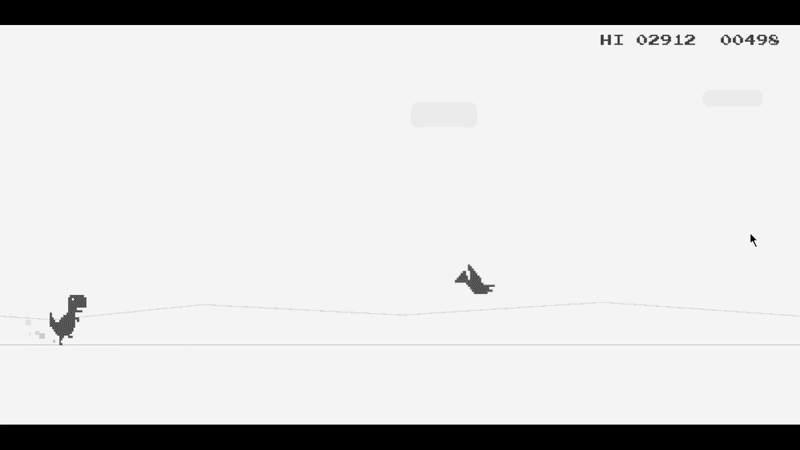

# 🦖 Java T-Rex Runner (Chrome Dino Clone)

A lightweight, highly optimized, and meticulously structured desktop clone of the classic Chrome offline dinosaur game. Built entirely from scratch using **Java SE (Swing/AWT)**, this project demonstrates clean Object-Oriented Programming (OOP) principles, custom 2D rendering pipelines, and efficient thread management.

---

## 👨‍💻 Authors

**Md. Mosharof Hossain** \
Department of Software Engineering  
Shahjalal University of Science and Technology (SUST)

---

## 🎮 Gameplay Preview

The following animation demonstrates the core gameplay mechanics, parallax scrolling, procedural obstacle generation, and particle effects.



---

## 🌟 Key Features

* **Custom 2D Rendering Pipeline**: A layered architectural pattern (`AbstractRenderer`) that strictly manages background, entity, particle, and UI drawing order.
* **Procedural Generation**: Infinite scrolling map with randomized Cactus groupings and varying Pterodactyl flight altitudes.
* **Dynamic Difficulty Scaling**: The global game speed dynamically increases every 500 points, escalating the challenge.
* **Parallax Environment**: Independent scrolling layers for clouds and horizon mountains to create a sense of depth.
* **Particle Engine**: Procedural dust particles generated at the dinosaur's feet when running on the ground.
* **Zero-Latency Audio**: Custom `SoundManager` pre-buffers `.wav` files into memory to guarantee immediate auditory feedback for jumps, ducks, and crashes.
* **Persistent High Scores**: File I/O integration seamlessly saves and loads your best run to local storage.

---

## 🕹️ Controls & Mechanics

### Objective
Survive as long as possible by dodging obstacles. Your score increases passively over time, with audio milestones every 500 points.

### Keyboard Controls
* **[SPACE] or [UP ARROW]**: Jump (Hold lock prevents infinite auto-jumping)
* **[DOWN ARROW]**: Duck (Shrinks hitbox to slide under high-flying Pterodactyls)
* **[SPACE] or [CLICK]**: Restart game from the Game Over screen.

---

## ⚙️ Technical Architecture

### Tech Stack
* **Language**: Java (JDK 11+ Recommended)
* **UI Framework**: Java Swing / AWT (Graphics2D)
* **Audio**: `javax.sound.sampled` API

### Design Patterns Utilized
1. **Game Loop Pattern**: A fixed 60-FPS delta-time loop running on a dedicated background thread to prevent UI freezing.
2. **Rendering Pipeline**: Separates visual logic into distinct modules (`BackgroundRenderer`, `ImageRenderer`, `ParticleRenderer`, `TextRenderer`).
3. **State Machine**: Simplifies global control flow using `GameState` enums (`PLAYING`, `GAME_OVER`).
4. **Bounding Box Collision**: Optimized AABB (Axis-Aligned Bounding Box) rectangle intersection math.

---

## 📂 Project Structure

```text
T-Rex_Runner/
├── src/
│   └── game/
│       ├── Main.java                 # Entry point & Swing EDT setup
│       ├── constant/                 # GameConfig (dimensions, physics) & GameState
│       ├── core/                     # GameEngine, InputHandler, Collision, SoundManager
│       ├── model/                    # Entities (Dino, Cloud, Particle, Obstacles)
│       └── view/
│           ├── GameWindow.java       # JFrame container
│           ├── GamePanel.java        # Main rendering canvas
│           └── renderer/             # Rendering pipeline modules
├── res/
│   ├── img/                          # Sprites (Dino, Cacti, Pterodactyls)
│   ├── audio/                        # Sound Effects (.wav)
│   └── other/                        # Custom Fonts (.ttf) & High_Score.txt
├── Dino_Gameplay.gif                 # Gameplay Preview
└── README.md                         # This file
```

---

## 🚀 Build & Run Instructions

This project requires exactly **zero external dependencies**. It runs entirely on native Java libraries.

### Using an IDE (IntelliJ IDEA / Eclipse)
1. Clone this repository.
2. Open the project folder in your preferred Java IDE.
3. Ensure the `res/` directory is marked as a **Resources Root**.
4. Locate `src/game/Main.java` and click **Run**.

---

## 📊 Game Constants & Physics

* **Window Dimensions**: 800 x 300 pixels
* **Target Frame Rate**: 60 FPS
* **Base Game Speed**: Dynamic (Scales up continuously)
* **Gravity Component**: Pulls entities down until reaching `GROUND_Y`
* **Font System**: Custom `PressStart2P-Regular.ttf` for authentic retro typography.

---

## 🤝 Feedback & Support

For issues, feature requests, or logic improvements, please contact.

---
*Developed with pure Java Graphics2D.*